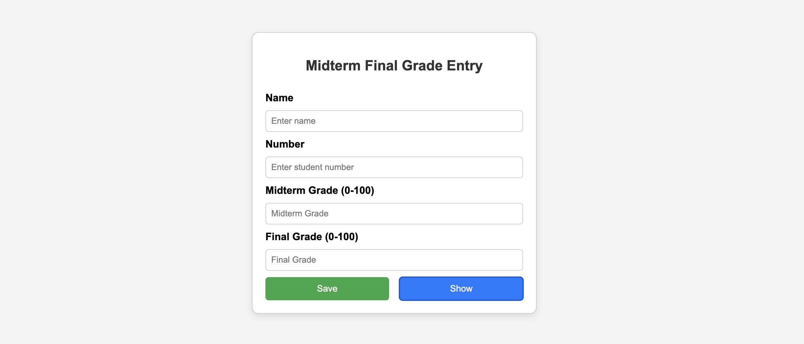
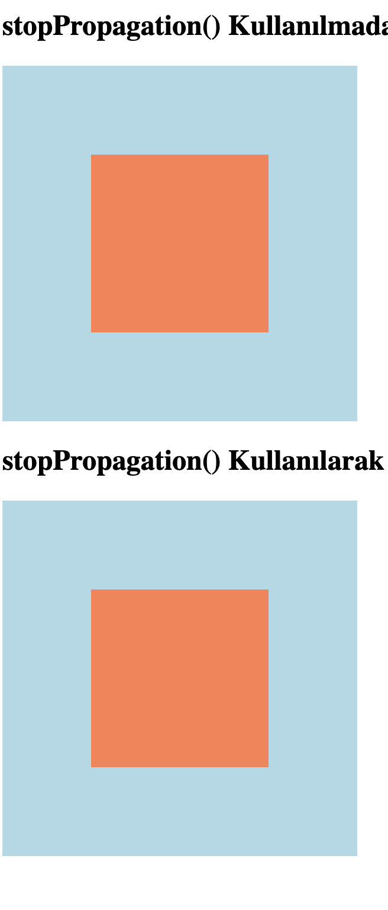

# 1. Grade Calculation Tool

This project is a simple web-based tool to help calculate and track grades. It was developed using **HTML**, **CSS**, and **JavaScript** to provide an interactive and user-friendly experience.

## Features

- **Input Fields**: Users can input their grades for different subjects.
- **Grade Calculation**: The tool automatically calculates the overall grade based on the inputted values.
- **Responsive Design**: The interface is designed to be responsive and accessible on both desktop and mobile devices.
- **Real-time Results**: As users enter their grades, the tool immediately calculates the total and average grade.

## Screenshots

# 2. Exam Score Calculation Tool

This project is a CLI-based tool developed to calculate exam scores. It is written in Ruby and calculates the success score based on the exam grades entered by the user.

## Features

- **Grade Input**: The user can input grades for different exams.
- **Success Score Calculation**: The tool automatically calculates the success score based on the entered grades.
- **CLI Application**: A user-friendly terminal-based interface.
- **Multiple Exam Support**: It allows entering grades for multiple exams and calculates the success score.

# 3. JavaScript stopPropagation Example

This project demonstrates the use of `stopPropagation()` in JavaScript to prevent event bubbling in the DOM. It provides an example where two nested `div` elements respond to click events, with the inner element stopping the event from propagating to the outer element.

## Features

- **Event Bubbling**: By default, events in JavaScript propagate from the innermost element to the outermost element.
- **stopPropagation()**: This method prevents the event from bubbling up to parent elements.
- **Interactive Example**: Click on the inner or outer `div` to see how `stopPropagation()` works.

## Screenshots

